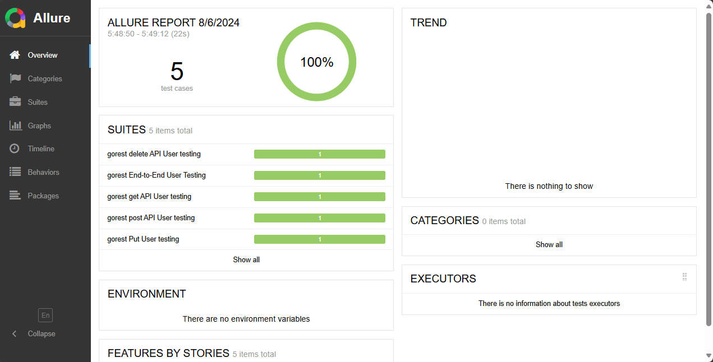

# Cypress API Automation Project

Proyek Pengujian API Automation ini menggunakan Cypress, JavaScript, dan Allure Report, dengan konsep Page Object Model.

API ini dibuat berdasarkan API dari https://gorest.co.in/

Proyek ini mengimplementasikan pengujian otomatis untuk API menggunakan Cypress sebagai framework pengujian berbasis Page Object Model (POM), JavaScript untuk bahasa pemrograman, dan Allure untuk pelaporan.

## Tujuan Proyek
- Mengelola dan menjalankan pengujian otomatis untuk metode GET, POST, PUT, dan DELETE pada API.
- Memastikan bahwa API berperilaku sesuai dengan spesifikasi dalam berbagai skenario.

## Struktur Proyek
- cypress.config.js = File konfigurasi Cypress dan Allure
- cypress/support/ = Folder untuk file dukungan, termasuk konfigurasi Allure
- cypress/e2e/ = Folder untuk file pengujian Cypress
- package.json = File konfigurasi npm dan skrip
- package-lock.json = File yang mencatat versi persis dari dependensi

## Instalasi
Untuk menginstal semua dependensi yang diperlukan, jalankan perintah berikut:
```sh
npm install
```

## Run Test
Untuk menjalankan semua test yang diperlukan, jalankan perintah berikut:
```sh
npm run cypress:run
```
```sh
npm run cypress:open
```

## Generate Allure report
Untuk menyimpan semua test ke dalam reporter allure, jalankan perintah berikut:
```sh
npm run test
```
setelah itu untuk membuka reporter, jalankan perintah berikut:
```sh
npm run allure:open
```

## Allure Report
 - 

## Video Running Report

### Video Hasil Pengujian

[Klik di sini untuk menonton video hasil pengujian](https://github.com/YusgarRisaldiYusup/Api_JavaScript_Cypress/raw/main/Code_55uLSw70zI.mp4)

